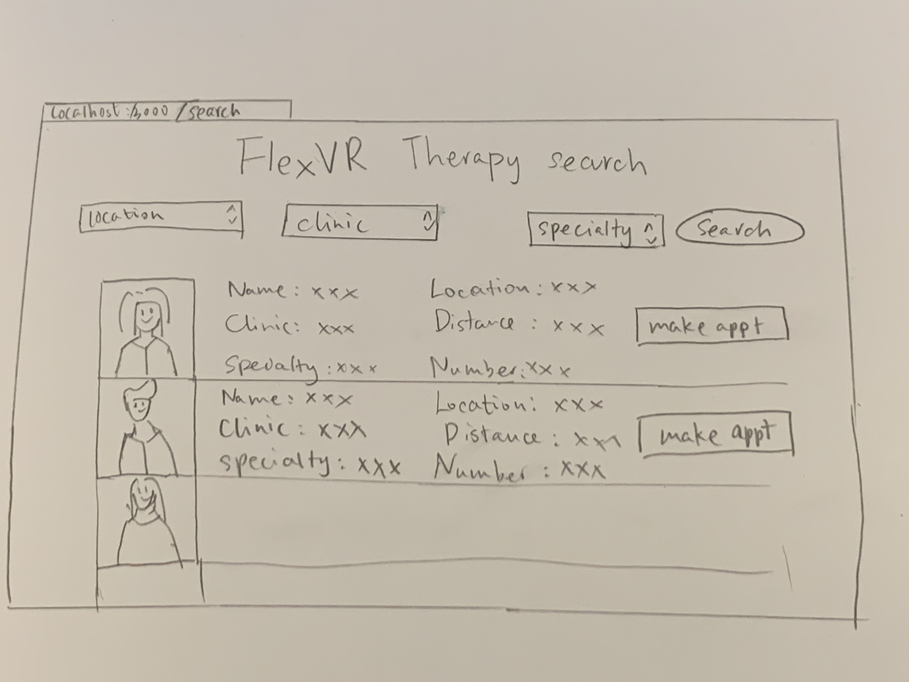
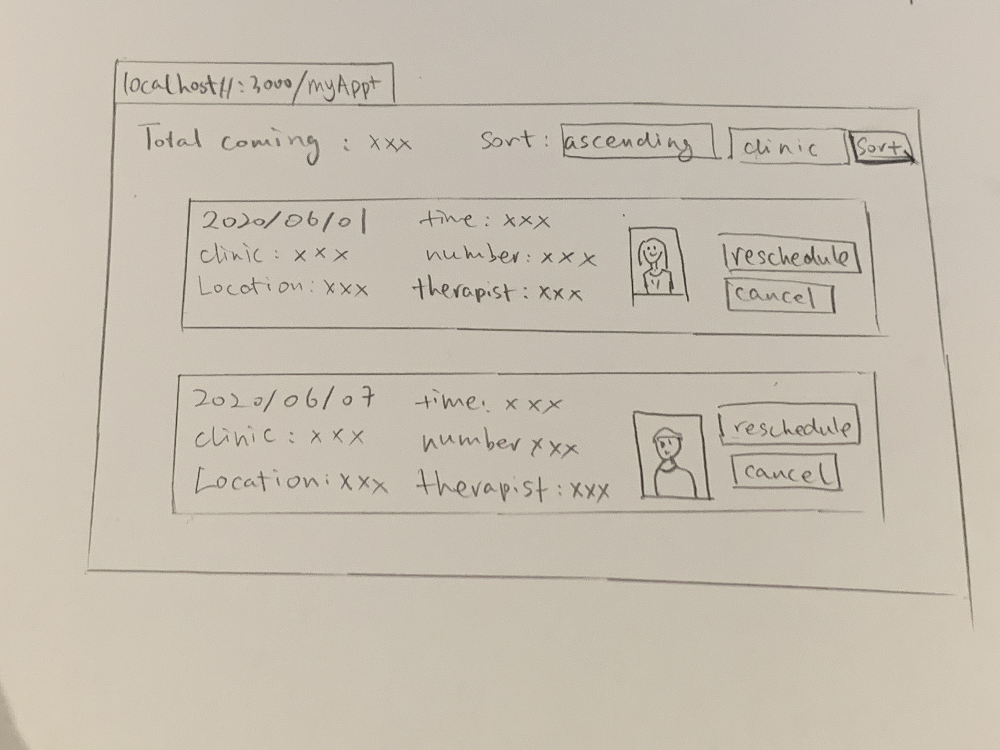
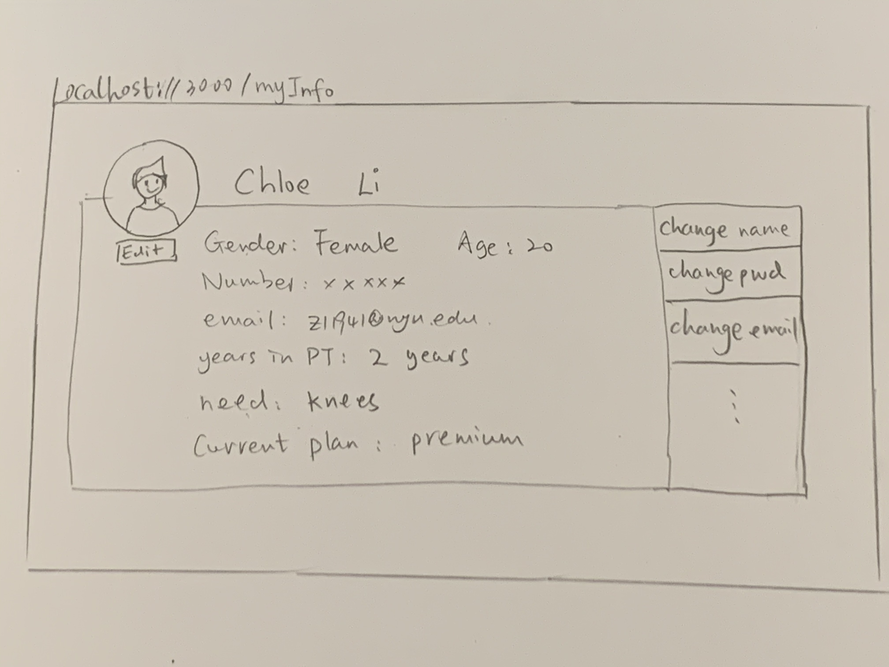
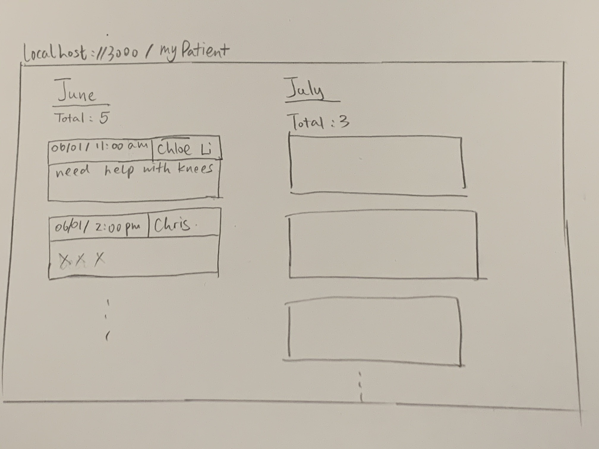

# Flex Physical Therapy Appointment System

## Overview

I have a VR Physical Therapy project on doing. It is a software help reform remote physical therapy. A link here if you are interested in the idea : https://flexvr.net. So to facilitate this, I want to build a log-in and appointment system for patients. 

Flex system can let patients search for their nearby or wanted physical therapist and then make appointments. Therapists can see their await patients with their basic health condition and infos to get idea ahead of meeting. 

And for single users, they can put in their preference to get a customized kit from us. 


## Data Model

The application will store patients, therapists, basic health information, Lists and Items
* users will have authentification as well as the therapists
* patients will be able to filter stored data of clinic and therapists. With images and UI presenting. 
* users can make multiple appointments in table, and view their appointments
* therapist can see their awaiting patients in table and according data


An Example patient:

```javascript
{
  firstName: "chloe",
  lastName:"Li",
  password: "xxxxxx",// a password hash,
  appointmentList: [{Obj-id-14535, ref to appointmentList}]
  gender:"female",
  age:"20",
  need:"knees",
  message:"I need therapy to recover from a surgery for my knees "
}
```

An Example List of appointments:

```javascript
{
  firstName: "Chloe",
  lastName: "Li",
  items: [
    { clinic: "nycPT", therapist: "bill cane", year:"2020",month:"5",day:"1"},
    { clinic: "city recovery", therapist: "julie rales", year:"2020",month:"6",day:"1"},
  ]
}
```
An Example therapist:

```javascript
{
    name:"julie rales",
    gender:"female",
    specialty:"legs, knees",
    availability:"2020/6/1", "2020/6/2","2020/6/3","2020/6/4" //... like an calender
}
```

## [Link to Commented First Draft Schema](db.js) 


## Wireframes 
### (the images crush sometimes, if so please check documentation folder)

/search - page to search and present all therapists



/myAppt - page for patient to see all upcoming appointment and make adjustments



/myInfo - page for patient's information



/myPatient - page to show patient in list for therapists



## Site map


## User Stories or Use Cases

1. as non-registered user, I can register a new account with the site
2. as a user, I can log in to the site
3. as a user, I can view and filter therapists
4. as a user, I can view all the appointments I made and make adjustment
5. as a user, I can change my own information
6. as a user(therapist), I can view all upcoming patients and their information

## Research Topics

* 5 points React.  Use a client-side JavaScript library or module that we did not cover in class (not including any from other requirements)

* (2 points)Bootstrap  Use a CSS framework throughout your site, use a reasonable of customization of the framework (don't just use stock Bootstrap 


* 1 point google calender API Per external API used

* 1 point google map API Per external API used


9 points total out of 8 required points

## [Link to Initial Main Project File](app.js) 

## Annotations / References Used
