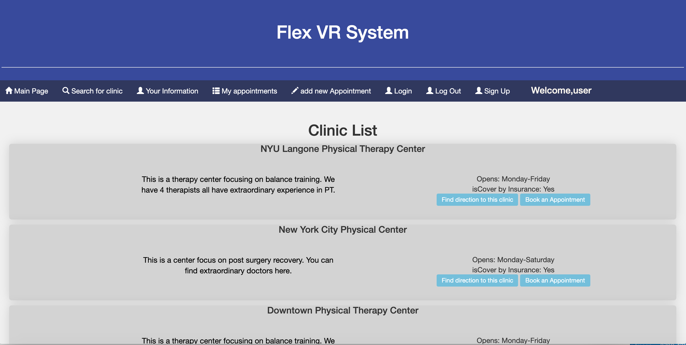

# Flex Physical Therapy Appointment System

## Final Present

## Overview

I have a VR Physical Therapy project on doing. It is a software help reform remote physical therapy. A link here if you are interested in the idea : https://flexvr.net. So to facilitate this, I want to build a log-in and appointment system for patients. 

Flex system can let patients search for their nearby or wanted physical therapist and then make appointments. Therapists can see their await patients with their basic health condition and infos to get idea ahead of meeting. 

And for single users, they can put in their preference to get a customized kit from us. 


## Data Model

The application will store patients, therapists, basic health information, Lists and Items
* users will have authentication 
* patients will be able to filter stored data of clinic.  With images and UI presenting. 
* users can make multiple appointments in table, and view their appointments
* Users can see the direction to clinics
* Users can edit their information


An Example patient:

```javascript
{
  firstName: "chloe",
  lastName:"Li",
  gender:"female",
  age:"20",
  need:"knees",
  message:"I need therapy to recover from a surgery for my knees ",
  username:"chloezql"
}
```

An Example List of appointments:

```javascript
{
  firstName:"chloe",
  lastName:"li",
  clinic: "NY center",
  therapist: "john",
  year:2020,
  month:11,
  day:19,
  hour:14,
  minute:30,
  userid:"chloezql"
}
```
An Example clinic:

```javascript
{
    name:"NY center",
    longitude:40.694549,
    latitude:-73.4579242,
    focus:"Focus on post surgery recovery",
    insuranceCover:"Yes",
    opendays:[1,2,3,4,5]
}
```

## [Link to Commented First Draft Schema](db.js) 


## Wireframes 
### (the images crush sometimes, if so please check documentation folder)

/login - page to login and sign up


/   -main page after login



/search - page to search and present all therapists


/myAppt - page for patient to see all upcoming appointment and make adjustments


/myInfo - page for patient's information


/direction - page to show the direction from user to a chosen clinic


## Site map


## User Stories or Use Cases

1. as non-registered user, I can register a new account with the site
2. as a user, I can log in to the site
3. as a user, I can view and see direction to clinics
4. as a user, I can view all the appointments I made and make adjustment
5. as a user, I can change my own information

## Research Topics

* 5 points React.  Use a client-side JavaScript library or module that we did not cover in class (not including any from other requirements)

* (2 points)Bootstrap  Use a CSS framework throughout your site, use a reasonable of customization of the framework (don't just use stock Bootstrap 


* 1 point google map API Per external API used


8 points total out of 8 required points

## [Link to Initial Main Project File](app.js) 

## Annotations / References Used

w3school, https://www.freecodecamp.org/forum/t/uncaught-syntaxerror-unexpected-token-lt/280400/2,https://medium.com/@maison.moa/setting-up-an-express-backend-server-for-create-react-app-bc7620b20a61,google map api documentaries, https://medium.com/@lowewenzel/serving-express-with-a-react-single-page-app-within-the-same-application-c168f1c44201, https://youtu.be/biI9OFH6Nmg
